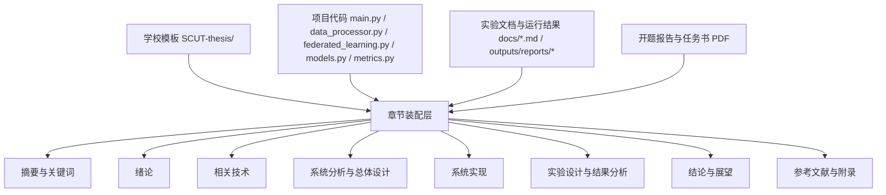

# Design Document

## Overview

本设计文档描述如何基于当前仓库中的 **学校论文模板、项目实现代码、实验说明与运行产物**，组织出本科毕业设计论文《基于联邦学习的车联网入侵检测系统设计与实现》的完整初稿。

当前仓库已具备较完整的论文支撑材料：

- **学校模板**：`SCUT-thesis/`，包含华南理工大学本科论文模板、章节文件、摘要文件、封面信息文件与官方格式示例。
- **工程实现依据**：`main.py`、`data_processor.py`、`federated_learning.py`、`models.py`、`metrics.py` 等，能够支撑系统设计与实现章节。
- **实验依据**：`docs/experimental_design.md`、`docs/experimental_results_summary.md`、`outputs/reports/federated_training_report.md`、`outputs/baseline_fedavg/reports/federated_training_report.md`。
- **补充材料**：`docs/刁闻导-开题报告.pdf`、`docs/本科毕业设计（论文）任务书-刁闻导.pdf`，用于补齐绪论措辞、研究目标和参考文献线索，但当前尚未成功提取其正文文本。

本设计的目标不是新增算法实现，而是设计一个**论文初稿装配方案**：把模板边界、代码事实、实验数据和待补信息系统化映射到论文章节中，确保下一阶段可以直接按章节落文。

### 设计决策

1. **优先直接复用 `SCUT-thesis/` 模板，而不是新建独立论文结构。**
   - 原因：仓库已包含学校模板与章节文件，最接近最终可提交形态。
2. **将论文正文拆分为“模板层 + 证据层 + 章节装配层”。**
   - 原因：模板、技术内容、实验结果的来源不同，分层后便于控制事实一致性。
3. **实验分析单独占据一个完整章节，而不是附着在实现章节末尾。**
   - 原因：本题目突出“联邦学习改进策略”和“性能验证”，实验需要单独展开对照、指标与分析。
4. **对无法从现有材料可靠获得的信息使用明确占位，而不编造。**
   - 原因：当前开题报告/任务书/正式文献列表尚未完整提取，必须保留事实边界。

## Architecture

论文初稿采用三层装配架构：

1. **模板层**：定义学校格式边界与输出文件位置。
2. **证据层**：汇聚代码实现、实验说明、结果摘要和开题材料。
3. **章节装配层**：按章节把证据翻译为学术化正文。



### 章节落位架构

结合当前模板 `SCUT-thesis/main.tex` 的组织方式，建议采用如下映射：

- `SCUT-thesis/docs/info.tex`
  - 填写论文题名、作者、学院、专业、导师、联系方式等封面元信息。
- `SCUT-thesis/docs/abstract.tex`
  - 填写中英文摘要与关键词。
- `SCUT-thesis/docs/chap01.tex`
  - 绪论：研究背景、研究意义、国内外研究现状、研究内容与论文结构。
- `SCUT-thesis/docs/chap02.tex`
  - 相关技术与理论基础：车联网、入侵检测、联邦学习、FedAvg/FedProx、CNN-LSTM、参数压缩与节点选择。
- `SCUT-thesis/docs/chap03.tex`
  - 系统需求分析与总体设计：系统目标、角色与场景、总体架构、数据流、模块划分。
- `SCUT-thesis/docs/chap04.tex`
  - 当前建议拆分为“系统实现”。
- `SCUT-thesis/docs/chap05.tex`（建议新增）
  - 实验设计与结果分析：实验环境、参数设置、对照组、指标、结果解释。
- `SCUT-thesis/docs/conclusion.tex`
  - 总结与展望。
- `SCUT-thesis/docs/ack.tex`
  - 致谢。
- `SCUT-thesis/docs/appendix1.tex`
  - 附录：命令示例、关键配置、结果文件说明等。

### 为什么建议新增 `chap05.tex`

模板默认仅包含四章正文，但当前项目材料中：

- 代码实现已足够支撑“系统实现”单独成章；
- 实验说明和结果摘要也已足够支撑“实验设计与结果分析”单独成章；
- 论文目标篇幅超过 20000 字，单独拆出实验章更符合本科毕设常见组织方式。

因此建议在 `SCUT-thesis/main.tex` 中新增 `\include{docs/chap05}`，并将 `chap04.tex` 专注于系统实现，`chap05.tex` 专注于实验与分析。

## Components and Interfaces

### 1. 模板适配组件

**职责**
- 识别学校论文模板的前置部分、正文章节和后置部分。
- 确定论文最终需要修改或新增的 `.tex` 文件。

**输入**
- `SCUT-thesis/main.tex`
- `SCUT-thesis/docs/info.tex`
- `SCUT-thesis/docs/abstract.tex`
- `SCUT-thesis/README.md`
- `SCUT-thesis/specifications/*.doc`

**输出**
- 模板文件修改清单
- 正文章节文件映射表
- 封面与摘要待填字段清单

**接口约束**
- 必须遵守 `main.tex` 当前前置顺序：封面 → 原创性声明 → 摘要 → 目录 → 图表目录 → 正文 → 结论 → 参考文献 → 致谢 → 附录。
- 若新增章节，必须同步修改 `SCUT-thesis/main.tex` 的 `\include` 列表。

### 2. 绪论与研究背景装配组件

**职责**
- 将题目、开题报告、任务书、README 中的研究背景与目标整理为绪论内容。
- 形成摘要、关键词、研究意义和论文结构说明。

**输入**
- 论文题名：`基于联邦学习的车联网入侵检测系统设计与实现`
- `README.md`
- `docs/刁闻导-开题报告.pdf`
- `docs/本科毕业设计（论文）任务书-刁闻导.pdf`

**输出**
- `SCUT-thesis/docs/abstract.tex`
- `SCUT-thesis/docs/chap01.tex`

**接口约束**
- 若 PDF 正文无法提取，则绪论仅使用当前仓库可证实的信息，并把“研究现状文献引用”“任务书原始措辞”标记为待补。
- 摘要中的研究目标必须与系统设计、实验结论保持一致。

### 3. 技术原理装配组件

**职责**
- 将项目实际用到的关键理论整理为“相关技术”章节。

**输入**
- `federated_learning.py`
- `models.py`
- `data_processor.py`
- `metrics.py`
- `docs/experimental_design.md`

**输出**
- `SCUT-thesis/docs/chap02.tex`

**应覆盖内容**
- 车联网入侵检测概念与挑战
- 联邦学习基本流程
- FedAvg 与 FedProx 的关系
- 三维节点选择机制（算力/电量/信道 + 公平性惩罚）
- Top-K 稀疏化与定点量化
- CNN-LSTM 模型结构
- 分类评价指标定义

### 4. 系统分析与总体设计组件

**职责**
- 将代码中的流程和模块边界整理为系统需求、总体架构和模块设计。

**输入**
- `main.py`
- `config.py`
- `schemas.py`
- `data_processor.py`
- `federated_learning.py`
- `models.py`

**输出**
- `SCUT-thesis/docs/chap03.tex`

**核心接口**
- CLI 接口：`preprocess / train / test`
- 配置接口：TOML/JSON → `AppConfig`
- 数据接口：原始表格数据 → 预处理数据集 → 客户端切分文件 → 模型检查点 → 评估报告

**架构描述重点**
- 系统采用“本地预处理 + 联邦训练 + 本地评估”的三阶段流程。
- 运行产物通过 `outputs/` 目录沉淀，实现可复现与可追踪。

### 5. 系统实现映射组件

**职责**
- 用代码事实支撑“系统实现”章节，避免空泛描述。

**输入**
- `data_processor.py`
- `federated_learning.py`
- `models.py`
- `runtime_utils.py`
- `app_logging.py`

**输出**
- `SCUT-thesis/docs/chap04.tex`

**实现章节建议结构**
- 数据预处理实现
- 客户端状态建模与数据切分实现
- 联邦训练与聚合实现
- 参数压缩与通信统计实现
- 全局模型评估与结果落盘实现
- 日志、元数据与证据报告实现

### 6. 实验与分析组件

**职责**
- 将实验设计文档、运行结果和对照方案整理为实验章节。

**输入**
- `docs/experimental_design.md`
- `docs/experimental_results_summary.md`
- `outputs/reports/federated_training_report.md`
- `outputs/baseline_fedavg/reports/federated_training_report.md`
- `outputs/reports/evaluation.json`（如需细化指标说明）

**输出**
- `SCUT-thesis/docs/chap05.tex`（建议新增）
- `SCUT-thesis/docs/appendix1.tex`（放命令、附加表格、文件说明）

**实验章节应包含**
- 实验目标与研究假设
- 数据集与复现实验数据说明
- 对照组与改进组设置
- 评价指标
- 实验命令与参数
- 关键结果对比
- 通信收益、训练收益、检测性能与隐私代理分析
- 局限性说明（当前演示数据样本量较小，正式论文建议用真实数据重复实验）

### 7. 文献与占位管理组件

**职责**
- 管理不能从当前仓库完全验证的信息，避免写作时越界编造。

**输入**
- 开题报告、任务书、后续用户补充的文献信息

**输出**
- 参考文献待补清单
- 封面字段待补清单
- 正文中的受控占位符

**接口约束**
- 参考文献优先来自开题报告，不足部分再由用户补充。
- 未确认的作者、导师、学号、邮箱、联系电话不得虚构。

## Data Models

### ThesisSourceIndex

用于描述每一章依赖哪些仓库材料。

```text
ThesisSourceIndex {
  chapter_id: string
  target_file: string
  source_files: string[]
  required: boolean
  notes: string
}
```

示例：
- `chap03` → `SCUT-thesis/docs/chap03.tex`
- 来源：`main.py`, `config.py`, `data_processor.py`, `federated_learning.py`, `models.py`

### ChapterPlan

用于约束每章的写作目标和边界。

```text
ChapterPlan {
  chapter_name: string
  objective: string
  sections: string[]
  evidence_paths: string[]
  placeholders: string[]
}
```

### EvidenceItem

用于把代码事实、实验结果、模板规范转化为可引用的写作证据。

```text
EvidenceItem {
  type: enum(template, code, experiment, report, taskbook, proposal)
  source_path: string
  fact: string
  confidence: enum(high, medium, low)
  chapter_targets: string[]
}
```

### CitationItem

用于管理正式参考文献与待补引用。

```text
CitationItem {
  title: string
  source: string
  status: enum(confirmed, placeholder)
  target_sections: string[]
}
```

## Error Handling

### 1. 开题报告或任务书正文暂不可提取

**处理策略**
- 继续基于 `README.md`、实验说明、代码实现生成可落地的完整初稿结构。
- 在以下位置保留受控待补项：
  - 国内外研究现状中的具体文献综述
  - 任务书中的原始任务描述
  - 正式参考文献条目

### 2. 模板与实际学院要求存在差异

**处理策略**
- 以仓库内 `SCUT-thesis/` 和 `specifications/` 为当前优先依据。
- 在计划阶段把“最终格式核对”列为独立步骤，允许后续微调页眉、页边距、声明页和章节层级。

### 3. 项目代码与论文叙述出现不一致

**处理策略**
- 论文叙述必须回退到代码中可以明确证明的事实。
- 对尚未实现但适合扩展的能力，只能写入“展望”，不能写成“已实现”。

### 4. 实验数据量不足以支撑强结论

**处理策略**
- 当前结果仅作为演示性复现实验与工程证据。
- 在实验分析中明确说明样本量限制，并引用 `docs/experimental_results_summary.md` 中“建议在真实数据上重复至少 3 次”的约束。

### 5. 封面个人信息缺失

**处理策略**
- `SCUT-thesis/docs/info.tex` 中除论文题名外，其余个人信息保持待补状态。
- 不为学号、导师、电话、邮箱等字段生成虚假值。

## Design Validation

本设计对需求的覆盖关系如下：

- **Requirement 1（完整论文结构）**：通过模板层与章节映射保证摘要、目录、正文、结论、参考文献和附录可完整落位。
- **Requirement 2（吸收开题/任务书）**：通过“绪论与研究背景装配组件”接入 PDF 材料，并对暂时无法提取的信息进行待补管理。
- **Requirement 3（对应项目代码）**：通过“系统分析与总体设计组件”“系统实现映射组件”将代码文件逐章映射到正文。
- **Requirement 4（实验与分析）**：通过“实验与分析组件”整合实验说明、改进方案结果和基线结果，形成可直接写作的实验章。
- **Requirement 5（自然、规范表达）**：通过文献与占位管理，确保只围绕可证实事实写作，减少模板化空话和越界编造。

## Research Findings Summary

本次设计阶段得到的关键研究结论如下：

1. 仓库中已经存在 **华工本科论文模板**，且包含封面、摘要、章节、结论、附录和官方规范示例，因此后续不需要从零设计论文骨架。
2. 项目实现采用 **预处理 → 联邦训练 → 本地评估** 三阶段命令行流程，核心入口在 `main.py`。
3. 联邦训练模块实现了 **FedAvg/FedProx、三维节点选择、公平性惩罚、Top-K 稀疏化、定点量化、通信统计、隐私代理分数与证据报告**，足以支撑系统设计与实现章节。
4. 模型采用 **Lightweight CNN-LSTM**，适合写入轻量化车联网入侵检测模型设计。
5. 仓库中已有改进方案与基线方案的结果摘要，可支撑论文中的对比实验与结果分析。
6. 当前主要缺口并非系统实现，而是 **开题报告正文提取、参考文献整理、封面个人信息补齐**；因此实施计划应优先解决这些缺口并推进章节写作。