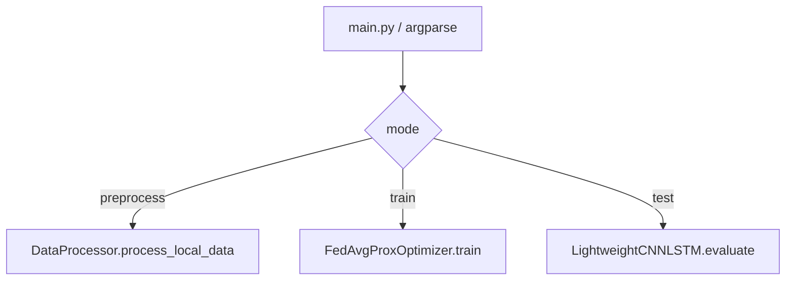

# Design Document

## Overview

当前仓库 `vanet_ids` 是一个 **Python 单仓原型项目**，主题为“基于联邦学习的车联网入侵检测系统”。从现有代码看，项目已经具备一个清晰的 **命令行入口 + 三个核心领域模块** 的骨架，但整体仍偏向 **论文/毕设演示原型**，尚未形成完整的可训练、可评估、可复现实验工程。

当前项目的主要目标语义如下：

1. **数据预处理**：对车载节点本地的 CAN 总线与 V2X 数据进行本地处理；
2. **联邦训练**：模拟多车载节点参与的联邦学习训练过程；
3. **本地检测评估**：在终端节点执行轻量化入侵检测模型评估。

当前已确认的仓库事实：

- 语言：Python
- 依赖声明：`requirements.txt`
- 入口文件：`main.py`
- 核心模块：`data_processor.py`、`federated_learning.py`、`models.py`
- 文档现状：无 `README`，缺少安装、数据准备、输出目录与实验步骤说明

## Architecture

### 1. 当前实现架构

项目采用非常轻量的分层方式：

- **CLI 调度层**：`main.py`
- **数据处理层**：`DataProcessor`
- **联邦训练层**：`FedAvgProxOptimizer`
- **模型层**：`LightweightCNNLSTM`

### 2. 运行入口

当前唯一入口为：

- `python3 main.py --mode preprocess`
- `python3 main.py --mode train --rounds 50 --clients 10`
- `python3 main.py --mode test`

参数说明：

- `--mode`：`train | test | preprocess`
- `--rounds`：全局通信轮数
- `--clients`：参与训练的车载节点数

### 3. 当前项目形态判断

当前仓库更接近 **可讲解业务流程的演示骨架**，而不是可直接用于实验复现的完整工程，原因包括：

- 依赖虽声明了 `torch / numpy / pandas / scikit-learn`，但源码中尚未真正导入和使用；
- 各模块主体仍以 `print(...)` 为主，没有真实的数据读写、训练更新、模型保存与指标计算逻辑；
- 缺少数据集路径、配置文件、日志、检查点、结果输出目录等工程化要素；
- `FedAvgProxOptimizer.train()` 中存在 `if r == 2: break`，会导致训练最多运行到第 3 轮，说明当前训练流程是演示性质；
- `LightweightCNNLSTM.build_model()` 仅有 `pass`，模型结构未实现；
- `evaluate()` 输出固定指标，说明并非基于真实推理结果。

### 4. 概念数据流

从命名与注释可推导出其“目标语义”数据流如下：

但需要明确：**上图是当前代码表达的意图，不是已经落地的真实实现链路**。现阶段模块之间尚未通过真实数据结构和模型参数建立闭环。

## Components and Interfaces

### 1. `main.py`

**职责**

- 解析命令行参数；
- 根据运行模式路由到对应模块；
- 作为当前项目唯一统一入口。

**关键接口**

- `main()`

**设计判断**

- 优点：结构简单，便于快速演示；
- 局限：参数较少，没有数据路径、模型输出路径、设备选择、日志级别等工程参数。

### 2. `data_processor.py`

**职责**

- 表达“分布式数据本地预处理”的业务语义；
- 面向车载节点本地数据处理，强调隐私不出本地。

**关键接口**

- `DataProcessor.__init__()`
- `DataProcessor.process_local_data()`

**当前实现状态**

- 仅打印处理步骤；
- 没有真实数据读取、特征工程、标签处理、输出缓存等逻辑。

**建议后续落点**

- 若要补全实现，应继续在本文件中增加：
  - 数据路径输入；
  - 数据加载与清洗；
  - 特征提取；
  - 训练/验证划分；
  - 本地持久化输出。

### 3. `federated_learning.py`

**职责**

- 模拟联邦学习训练主过程；
- 承担客户端选择、轮次控制与全局聚合语义。

**关键接口**

- `FedAvgProxOptimizer.__init__(num_clients=10, global_rounds=50)`
- `FedAvgProxOptimizer.select_clients()`
- `FedAvgProxOptimizer.train()`

**当前实现状态**

- `select_clients()` 返回简单的下标列表；
- `train()` 仅打印每轮流程，没有本地训练、梯度/参数聚合、模型同步逻辑；
- 第 3 轮后强制 `break`，不符合参数化轮数语义。

**建议后续落点**

- 若要实现真正训练闭环，应继续在本文件中增加：
  - 客户端状态建模；
  - 本地训练调用；
  - FedAvg / FedProx 聚合实现；
  - 模型压缩策略的真实实现；
  - 模型参数保存与恢复。

### 4. `models.py`

**职责**

- 承载轻量化 CNN-LSTM 入侵检测模型定义与评估能力。

**关键接口**

- `LightweightCNNLSTM.__init__()`
- `LightweightCNNLSTM.build_model()`
- `LightweightCNNLSTM.evaluate()`

**当前实现状态**

- `build_model()` 未实现；
- `evaluate()` 输出固定指标，不依赖真实样本或模型参数；
- 与训练模块没有真实交互。

**建议后续落点**

- 若要补全实现，应继续在本文件中增加：
  - PyTorch 模型结构；
  - 前向传播；
  - 损失函数与推理逻辑；
  - 模型加载与指标计算。

### 5. `requirements.txt`

**职责**

- 声明项目计划使用的第三方依赖。

**当前状态**

- 已声明：`torch`, `numpy`, `pandas`, `scikit-learn`；
- 但当前源码未真正使用这些库，说明依赖声明领先于代码实现。

## Data Models

当前仓库中 **没有显式的数据模型类或结构化 schema**，因此只能总结概念层面的数据对象：

| 概念对象 | 当前来源 | 当前状态 | 缺失内容 |
|---|---|---|---|
| 原始车联网数据 | `DataProcessor.dataset` 注释语义 | 仅字符串说明 | 文件格式、字段定义、路径配置 |
| 本地特征数据 | `process_local_data()` 语义 | 未落地 | 特征列、标签列、存储格式 |
| 客户端集合 | `FedAvgProxOptimizer.num_clients` | 以整数和下标列表表达 | 客户端状态、样本量、设备能力 |
| 全局模型参数 | `train()` / `evaluate()` 语义 | 未落地 | 参数格式、同步协议、序列化 |
| 评估指标 | `evaluate()` 打印内容 | 固定文本 | 实际计算逻辑、数据来源、结果文件 |

### 设计结论

如果后续要把该项目从演示骨架推进到可用工程，建议优先补齐以下结构：

- `ClientState`：描述联邦客户端状态；
- `TrainingConfig`：描述训练轮数、批量、学习率、设备等参数；
- `DatasetConfig`：描述数据目录、特征配置、标签映射；
- `EvalResult`：统一评估输出；
- 模型检查点与聚合结果文件格式。

## Error Handling

当前项目几乎没有真正的错误处理机制，主要风险如下：

1. **无数据路径校验**：预处理流程没有读取任何真实文件，因此未来接入数据后容易出现路径、格式和编码错误；
2. **无训练过程异常捕获**：联邦训练未来接入真实框架后，设备不可用、客户端失败、参数维度不一致等问题都未预留处理；
3. **无模型加载失败处理**：测试流程默认“加载成功”，但没有检查模型文件或参数格式；
4. **无结果持久化**：当前所有输出都停留在终端打印，缺少日志、模型文件和指标文件；
5. **参数语义与实现不一致**：`global_rounds` 参数看似可配置，但内部存在第 3 轮强制退出逻辑；
6. **依赖声明与实现脱节**：安装依赖后也无法得到真实训练/推理能力，容易造成使用者误解。

### 建议的排障优先级

1. 先补 `README` 与运行说明；
2. 去掉演示性质的硬编码行为（如第 3 轮 `break`、固定评估指标）；
3. 引入最小可运行数据流：数据读取 -> 特征输出 -> 模型训练 -> 参数保存 -> 评估；
4. 再补齐日志、配置和异常处理。
